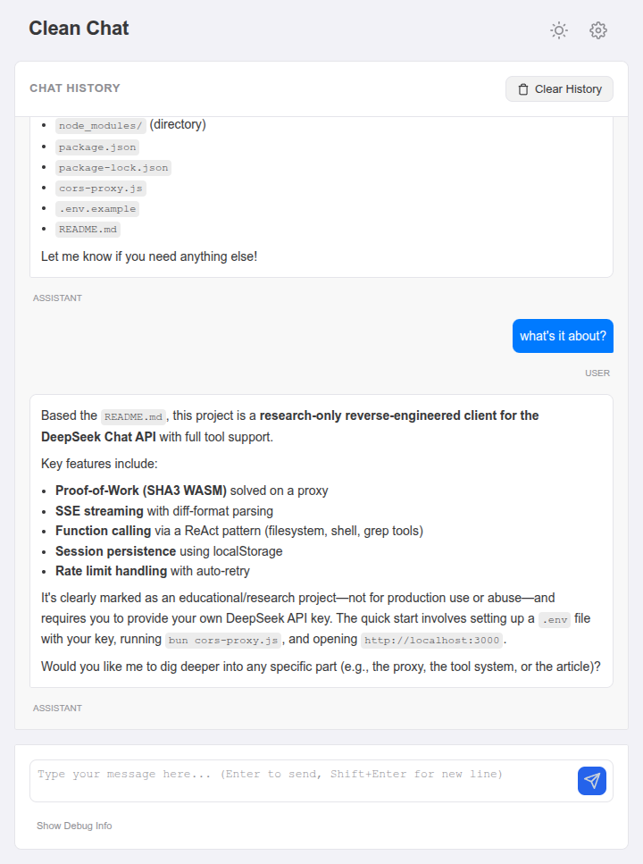

# DeepSeek Chat API Demo

Research-only reverse-engineered client for DeepSeek Chat API with full tool support.



## Features

- Proof-of-Work (SHA3 WASM) solved on proxy
- SSE streaming with diff-format parsing
- Function calling via ReAct pattern (fs, shell, grep)
- Session persistence (localStorage)
- Rate limit handling with auto-retry

## ⚠️ Disclaimer

**This is a research/educational project only.** Do not use to abuse, scrape, or overload DeepSeek's services. Respect their ToS and rate limits. Use responsibly.

- Not affiliated with or endorsed by DeepSeek
- Use at your own risk and in compliance with [DeepSeek's Terms of Service](https://chat.deepseek.com/terms)
- No API keys included — you must provide your own
- Rate limiting is implemented; respect it
- Not production-ready — demo/educational purposes only

## License

MIT License — see [LICENSE](LICENSE) for details.

## Quick Start

```bash
# .env
DEEPSEEK_API_KEY=sk-xxx

# Terminal 1
bun cors-proxy.js

# Open http://localhost:3000
```

## Documentation

See [ARTICLE.md](ARTICLE.md) for technical deep-dive.
